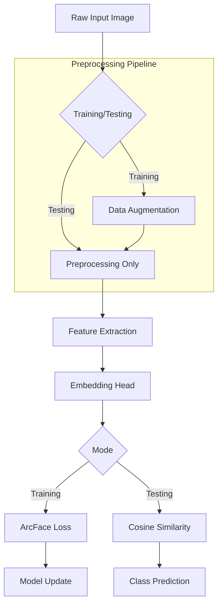
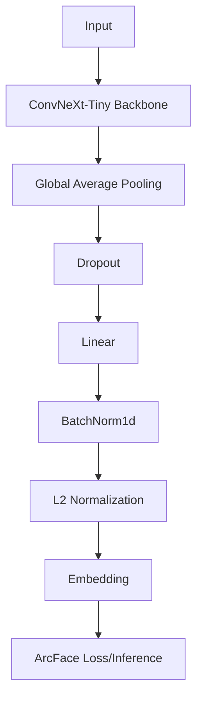
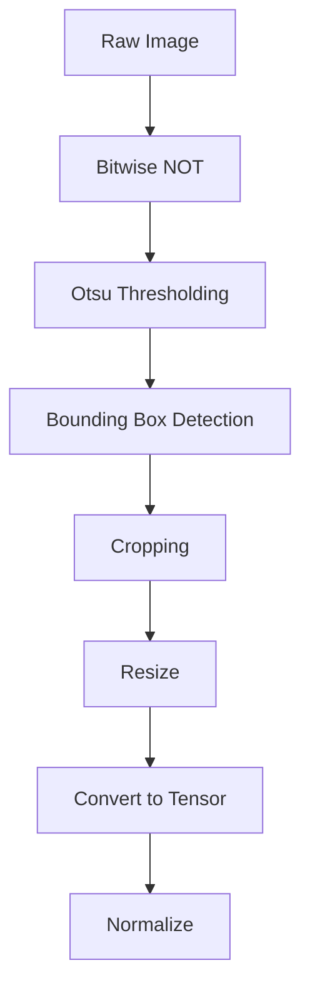
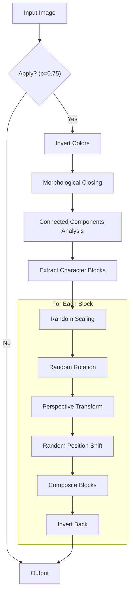

# Report
## Introduction
### Background and Motivation
Optical Character Recognition (OCR) and text classification have been fundamental challenges in computer vision, particularly when dealing with distorted, overlapped, and deformed characters similar to CAPTCHA (Completely Automated Public Turing test to tell Computers and Humans Apart) systems. This project addresses the classification of computer-generated Chinese character images representing company names, where each class corresponds to a unique company identifier.

The primary challenges in this task include:
- Character deformation: Random scaling, rotation, and perspective transformations
- Spatial variations: Vertical misalignment and irregular spacing between characters
- Character overlap: Partial occlusion between adjacent characters
- Anti-recognition design: Deliberate distortions similar to anti-bot CAPTCHA systems

### Objectives
The main objectives of this work are:
1. Develop a robust classification system capable of handling severely distorted Chinese character images
2. Design effective preprocessing and augmentation strategies to enhance model generalization
3. Leverage metric learning approaches (ArcFace) to improve feature discriminability
4. Evaluate the model's performance through comprehensive validation and ablation studies

### Problem Formulation
Given an input image $\mathbf{x}\in\mathbb{R}^{H{\times}W}$ containing computer-generated Chinese characters, our goal is to learn a mapping $f:\mathbb{R}^{H{\times}W}\rightarrow\mathbb{R}^{C}$, where $C$ is the number of company classes. We approach this as a metric learning problem by learning an embedding function $\phi:\mathbb{R}^{H{\times}W}\rightarrow\mathbb{R}^{d}$ that maps images to a $d$-dimensional embedding space where intra-class distances are minimized and inter-class distances are maximized.

## Architecture and Methodology
### Overall Pipeline
The complete system consists of four major components: preprocessing, data augmentation, feature extraction, and metric learning-based classification.



### Feature Extraction Architecture
We employ a modified ConvNeXt-Tiny architecture as the backbone network, followed by an embedding head:


Architecture Details:
| Component           | Configuration                          |
| ------------------- | -------------------------------------- |
| Backbone            | ConvNeXt-Tiny (pretrained on ImageNet) |
| Input Channels      | 1 (Grayscale)                          |
| Input Shape         | 224x224                                |
| Feature Dimension   | 768                                    |
| Embedding Dimension | 384                                    |
| Dropout Rate        | 0.675                                  |
| Drop Path Rate      | 0.25                                   |

### Metric Learning with ArcFace
Instead of traditional softmax classification, I employ ArcFace loss to learn discriminative embeddings. The ArcFace loss introduces an additive angular margin penalty:
$$\begin{align*}
\mathcal{L}_\text{ArcFace}&=-\frac{1}{N}\sum_{i=1}^{N}{\ln{\frac{e^{s\cos{(\theta_{y_i}+m)}}}{e^{s\cos{(\theta_{y_i}+m)}}+\sum_{j{\ne}y_i}{e^{s\cos{\theta_j}}}}}} \\
\end{align*}$$
where:
- $s$ is the feature scale
- $m$ is the angular margin
- $\theta_{y_i}$ is the angle between the embedding and the ground-truth class weight
- $N$ is the batch size

Advantages of ArcFace over Softmax:
1. Geometric interpretation: Enforces geodesic distance margin in hypersphere
2. Better generalization: Margin constraint improves inter-class separability
3. Robustness: More discriminative features for distorted inputs

## Dataset and Preprocessing
### Dataset Description
| Split    | Number of Images | Number of Classes |
| -------- | ---------------- | ----------------- |
| Training | 1000             | 100               |
| Testing  | 10000            | 100               |

Dataset Characteristics:
- Image format: PNG images (read as grayscale)
- Content: Computer-generated Chinese characters (company names)
- Challenges: Random rotation, scaling, perspective distortion, character overlap
- Organization: Organized by company ID in subdirectories

### Data Preprocessing
The preprocessing pipeline transforms raw images into normalized tensors suitable for network input:


Preprocessing Steps:
1. Color Inversion: Convert dark characters on light background to light on dark
2. Otsu Thresholding: Automatic binary segmentation without manual parameter tuning
3. Bounding Box Extraction: Remove unnecessary background, focus on character region
4. Resizing: Standardize input size (224x224) while preserving aspect ratio information
5. Normalization: Zero-mean, unit-variance normalization using training statistics

### Data Augmentation
To improve model robustness and generalization, I designed a custom augmentation strategy that simulates the natural variations in CAPTCHA-like images before preprocessing to better preserve the original spatial structure and deformation patterns of the raw input.

#### Augmentation Pipeline


#### Augmentation Techniques
1. Character Block Extraction:
    - Morphological closing with a kernel (5x5) to connect nearby components
    - Connected component analysis to identify individual character regions
    - Filter blocks by minimum size ratio (some percent (1%) of image dimensions)
2. Geometric Transformations (per block):
    - Scaling: Simulate size variations (`2.5e-3`)
    - Rotation: Add angular diversity (`37.5`)
    - Perspective Warp: Inroduce non-affine deformations (`7.5e-2`)
    - Position Shift: Break spatial correlations

## Model Selection and Training
### Model Architecture
We selected ConvNeXt-Tiny as the backbone network for the following reasons:
- Modern Architecture: ConvNeXt modernizes the standard ResNet design with depthwise convolutions and inverted bottlenecks
- Efficiency: Tiny variant provides excellent accuracy-efficiency trade-off
- Pre-training: Leverages ImageNet pre-trained weights despite single-channel input
- Regularization: Built-in stochastic depth (drop path) for better generalization

Architecture Modifications:
1. Input Adaptation: Modified first convolutional layer for single-channel grayscale input
2. Head Removal: Removed original classification head, retain feature extractor only
3. Weight Initialization: Leveraged ImageNet pretrained weights with channel adaptation
4. Regularization: Applied stochastic depth (0.25)

Custom Embedding Head:
| Layer        | Purpose                     | Configuration |
| ------------ | --------------------------- | ------------- |
| Dropout      | Prevent overfitting         | p = 0.675     |
| Linear       | Dimension reduction         | 768 -> 384    |
| BatchNorm1d  | Stabilize training          | Default       |
| L2 Normalize | Project to unit hypersphere | Default       |

### Loss Function and Optimization
#### Loss Function
We employ ArcFace Loss (Additive Angular Margin Loss) which enforces a geodesic distance margin in the hypersphere embedding space:
$$\begin{align*}
\mathcal{L}_\text{ArcFace}&=-\frac{1}{N}\sum_{i=1}^{N}{\ln{\frac{e^{s\cos{(\theta_{y_i}+m)}}}{e^{s\cos{(\theta_{y_i}+m)}}+\sum_{j{\ne}y_i}{e^{s\cos{\theta_j}}}}}} \\
\end{align*}$$
where $\cos{\theta_j}=\mathbf{W}_j^T\mathbf{x}_i$ represents the cosine similarity between the normalized embedding $\mathbf{x}_i$ and class weight $\mathbf{W}_j$.

Hyperparameters:
- Scale $s=32$: Controls the magnification of angular separations
- Margin $m=52^\circ$: Enforces minimum angular separation between classes

#### Optimization Strategy
Optimizer Configuration:
| Component    | Configuration      |
| ------------ | ------------------ |
| Optimizer    | AdamW              |
| Weight Decay | $7.5\times10^{-3}$ |
| Batch Size   | 64                 |
| Total Epochs | 1000               |

Learning Rate Schedule:
We use OneCycleLR scheduler for efficient training:
- `max_lr`: `1e-4`
- `pct_start`: `0.125`
- `div_factor`: `1e3`
- `final_div_factor`: `1e4`

### Training Procedure
We employ 3-fold (smallest class contains only 3 samples, making higher fold numbers impractical due to StratifiedKFold instability warnings, although StratifiedKFold can handle it) stratified cross-validation to ensure robust performance estimation. After cross-validation, we train the final model on train-validation split (80/20) and subsequently on the full training set. Finally, we train the model on the entire dataset for 1000 epochs to maximize performance before testing.

## Evaluation and Results
### Evaluation Metrics
- Accuracy
- Macro F1-Score (average F1-score across all classes)
- Macro Precision (average precision across all classes)
- Macro Recall (average recall across all classes)

### Ablation Studies
We conducted systematic ablation studies to validate design choices:
1. Effect of ArcFace Loss: Compared with standard softmax loss to demonstrate improved feature discriminability
2. Impact of Data Augmentation: Evaluated performance with and without the custom augmentation pipeline
3. Backbone Comparison: Compared ConvNeXt-Tiny with ResNet50D to assess architecture impact

All ablation experiments were conducted under the same conditions except for the specific component being tested to ensure fair comparisons.

### Environments
#### Hardware
The experiments were conducted across multiple computing platforms to support different stages of model development, training, and inference.

- Local Development Machine
    - OS: Ubuntu 24.04 (Linux kernel 6.17.0)
    - GPU: NVIDIA GeForce RTX 5060 Ti (16GB VRAM)
    - CUDA Version: 13.2
    - Driver Version: 595.80
    - Usage: ConvNeXt + ArcFace + Aug, ConvNeXt + CE + Aug
- Cloud Studio, Tencent Cloud
    - GPU: NVIDIA A10 (24GB VRAM)
    - CUDA Version: 13.0
    - Driver Version: 580.65.06
    - Usage: ResNet50D + ArcFace + Aug
- Kaggle
    - GPU: NVIDIA T4(x2) (16GB VRAM each)
    - Usage: ConvNeXt + ArcFace (no aug) (with out final testing inference)
- M4 MacBook Air 13 (32GB RAM)
    - OS: Darwin Kernel Version 25.5.0
    - Usage: Final testing inference for ConvNeXt + ArcFace (no aug)

#### Software
The software environment was configured using PDM (Python Development Master) to ensure reproducibility and manage dependencies effectively. But for the Kaggle environment, which uses a predefined set of libraries, I customized the `requirements.txt` to match the necessary versions for my experiments.

### K-Fold Cross-Validation Results
- ConvNeXt + ArcFace + Aug
    ```text
    Fold 1/3                                                                                                                                                                                                     
    Epoch 1000/1000, Loss: 24.701395                                                                                                                                                                             
    Epoch 1/1: 100%|███████████████████████████████████████████████████████████████████████████████████████████████████████████████████████████████████████████████████████████████| 6/6 [00:01<00:00,  3.30it/s]
    Epoch 1/1, Loss: 24.125830                                                                                                                                                                                   
    Accuracy: 1.4970%, F1 Score: 0.0295%, Precision: 0.0150%, Recall: 1.0000%                                                                                                                                    
    Fold 2/3                                                                                                                                                                                                     
    Epoch 1000/1000, Loss: 1.883737                                                                                                                                                                              
    Epoch 1/1: 100%|███████████████████████████████████████████████████████████████████████████████████████████████████████████████████████████████████████████████████████████████| 6/6 [00:01<00:00,  3.21it/s]
    Epoch 1/1, Loss: 0.501867                                                                                                                                                                                    
    Accuracy: 99.0991%, F1 Score: 99.1310%, Precision: 99.5000%, Recall: 99.1000%                                                                                                                                
    Fold 3/3                                                                                                                                                                                                     
    Epoch 1000/1000, Loss: 2.339689                                                                                                                                                                              
    Epoch 1/1: 100%|███████████████████████████████████████████████████████████████████████████████████████████████████████████████████████████████████████████████████████████████| 6/6 [00:01<00:00,  3.85it/s]
    Epoch 1/1, Loss: 0.170302                                                                                                                                                                                    
    Accuracy: 99.6997%, F1 Score: 99.8182%, Precision: 99.8333%, Recall: 99.8333%                                                                                                                                
    Average Accuracy: 66.7653%                                                                                                                                                                                   
    Average F1-Score: 66.3262%                                                                                                                                                                                   
    Average Precision: 66.4494%                                                                                                                                                                                  
    Average Recall: 66.6444%                                                                                                                                                                                     
    ```
- ConvNeXt + CE + Aug
    ```text
    Fold 1/3                                                                                                                                                                                                     
    Epoch 1000/1000, Loss: 0.013675                                                                                                                                                                              
    Epoch 1/1: 100%|███████████████████████████████████████████████████████████████████████████████████████████████████████████████████████████████████████████████████████████████| 6/6 [00:01<00:00,  3.82it/s]
    Epoch 1/1, Loss: 0.001625                                                                                                                                                                                    
    Accuracy: 100.0000%, F1 Score: 100.0000%, Precision: 100.0000%, Recall: 100.0000%                                                                                                                            
    Fold 2/3                                                                                                                                                                                                     
    Epoch 1000/1000, Loss: 0.003722                                                                                                                                                                              
    Epoch 1/1: 100%|███████████████████████████████████████████████████████████████████████████████████████████████████████████████████████████████████████████████████████████████| 6/6 [00:01<00:00,  3.72it/s]
    Epoch 1/1, Loss: 0.038737                                                                                                                                                                                    
    Accuracy: 99.0991%, F1 Score: 99.1310%, Precision: 99.5000%, Recall: 99.1000%                                                                                                                                
    Fold 3/3                                                                                                                                                                                                     
    Epoch 1000/1000, Loss: 0.009004                                                                                                                                                                              
    Epoch 1/1: 100%|███████████████████████████████████████████████████████████████████████████████████████████████████████████████████████████████████████████████████████████████| 6/6 [00:01<00:00,  4.62it/s]
    Epoch 1/1, Loss: 0.029499                                                                                                                                                                                    
    Accuracy: 99.3994%, F1 Score: 99.5325%, Precision: 99.5833%, Recall: 99.5833%                                                                                                                                
    Average Accuracy: 99.4995%                                                                                                                                                                                   
    Average F1-Score: 99.5545%                                                                                                                                                                                   
    Average Precision: 99.6944%                                                                                                                                                                                  
    Average Recall: 99.5611%                                                                                                                                                                                     
    ```
- ConvNeXt + ArcFace (no aug) 
    ```text
    Fold 1/3
    Epoch 1000/1000, Loss: 1.155282
    Epoch 1/1: 100%|██████████| 6/6 [00:03<00:00,  1.88it/s]
    Epoch 1/1, Loss: 9.862408
    Accuracy: 82.0359%, F1 Score: 77.6766%, Precision: 80.1643%, Recall: 79.1333%
    Fold 2/3
    Epoch 1000/1000, Loss: 1.149355
    Epoch 1/1: 100%|██████████| 6/6 [00:03<00:00,  1.85it/s]
    Epoch 1/1, Loss: 9.462446
    Accuracy: 83.4835%, F1 Score: 80.3847%, Precision: 83.8802%, Recall: 81.6500%
    Fold 3/3
    Epoch 1000/1000, Loss: 1.140716
    Epoch 1/1: 100%|██████████| 6/6 [00:02<00:00,  2.45it/s]
    Epoch 1/1, Loss: 11.927896
    Accuracy: 77.7778%, F1 Score: 74.8926%, Precision: 79.2512%, Recall: 76.2833%
    Average Accuracy: 81.0991%
    Average F1-Score: 77.6513%
    Average Precision: 81.0985%
    Average Recall: 79.0222%
    ```
- ResNet50D + ArcFace + Aug
    ```text
    Fold 1/3
    Epoch 1000/1000, Loss: 21.634931
    Epoch 1/1: 100%|████████████████████████████████████████████████████████████████████████████████| 6/6 [00:01<00:00,  5.02it/s]
    Epoch 1/1, Loss: 26.873678
    Accuracy: 36.5269%, F1 Score: 27.0160%, Precision: 26.9692%, Recall: 31.7833%
    Fold 2/3
    Epoch 1000/1000, Loss: 23.569543
    Epoch 1/1: 100%|████████████████████████████████████████████████████████████████████████████████| 6/6 [00:01<00:00,  4.78it/s]
    Epoch 1/1, Loss: 23.819496
    Accuracy: 12.3123%, F1 Score: 4.8745%, Precision: 4.9901%, Recall: 9.2000%
    Fold 3/3
    Epoch 1000/1000, Loss: 23.036406
    Epoch 1/1: 100%|████████████████████████████████████████████████████████████████████████████████| 6/6 [00:01<00:00,  4.82it/s]
    Epoch 1/1, Loss: 23.607637
    Accuracy: 32.1321%, F1 Score: 20.5639%, Precision: 22.7857%, Recall: 26.2000%
    Average Accuracy: 26.9905%
    Average F1-Score: 17.4848%
    Average Precision: 18.2483%
    Average Recall: 22.3944%
    ```

### Train-Validation Split (80/20) Results
- ConvNeXt + ArcFace + Aug
    ```text
    Epoch 1000/1000, Loss: 2.053528                                                                                                                                                                              
    Epoch 1/1: 100%|███████████████████████████████████████████████████████████████████████████████████████████████████████████████████████████████████████████████████████████████| 4/4 [00:01<00:00,  2.26it/s]
    Epoch 1/1, Loss: 0.148379                                                                                                                                                                                    
    Accuracy: 99.5000%, F1 Score: 99.6000%, Precision: 99.6667%, Recall: 99.6667%                                                                                                                                
    ```
- ConvNeXt + CE + Aug
    ```text
    Epoch 1000/1000, Loss: 0.006189                                                                                                                                                                              
    Epoch 1/1: 100%|███████████████████████████████████████████████████████████████████████████████████████████████████████████████████████████████████████████████████████████████| 4/4 [00:01<00:00,  2.86it/s]
    Epoch 1/1, Loss: 0.004790                                                                                                                                                                                    
    Accuracy: 99.5000%, F1 Score: 99.6000%, Precision: 99.6667%, Recall: 99.6667%                                                                                                                                
    ```
- ConvNeXt + ArcFace (no aug)
    ```text
    Epoch 1000/1000, Loss: 1.180041
    Epoch 1/1: 100%|██████████| 4/4 [00:02<00:00,  1.66it/s]
    Epoch 1/1, Loss: 4.132246
    Accuracy: 92.0000%, F1 Score: 87.2048%, Precision: 88.0833%, Recall: 88.5000%
    ```
- ResNet50D + ArcFace + Aug
    ```text
    Epoch 1000/1000, Loss: 21.928312
    Epoch 1/1: 100%|████████████████████████████████████████████████████████████████████████████████| 4/4 [00:01<00:00,  3.71it/s]
    Epoch 1/1, Loss: 22.420118
    Accuracy: 20.5000%, F1 Score: 9.5534%, Precision: 7.9730%, Recall: 15.3333%
    ```

### Final Test Set Results
- ConvNeXt + ArcFace + Aug
    ```text
    Accuracy: 99.5600%, F1 Score: 99.5601%, Precision: 99.5945%, Recall: 99.5549%                                                                                                                                
    ```
- ConvNeXt + CE + Aug
    ```text
    Accuracy: 99.6200%, F1 Score: 99.6201%, Precision: 99.6615%, Recall: 99.6096%                                                                                                                                
    ```
- ConvNeXt + ArcFace (no aug)
    ```text
    Accuracy: 97.2800%, F1 Score: 97.2517%, Precision: 97.5168%, Recall: 97.2355%
    ```
- ResNet50D + ArcFace + Aug
    ```text
    Accuracy: 7.6300%, F1 Score: 4.0886%, Precision: 10.2770%, Recall: 7.5593%
    ```

### Training Dynamics
- Loss curves for K-Fold Cross-Validation (3 curves overlaid)
    - ConvNeXt + ArcFace + Aug
        
    - ConvNeXt + CE + Aug
        
    - ConvNeXt + ArcFace (no aug)
        
    - ResNet50D + ArcFace + Aug
        
- Loss curve for train-validation split (80/20)
    - ConvNeXt + ArcFace + Aug
        
    - ConvNeXt + CE + Aug
        
    - ConvNeXt + ArcFace (no aug)
        
    - ResNet50D + ArcFace + Aug
        
- Loss curve for final training on full dataset
    - ConvNeXt + ArcFace + Aug
        
    - ConvNeXt + CE + Aug
        
    - ConvNeXt + ArcFace (no aug)
        
    - ResNet50D + ArcFace + Aug
        

## Analysis and Conclusion
### Performance Analysis
The experimental results demonstrate that the proposed system effectively addresses the challenges of distorted Chinese character recognition under CAPTCHA-like conditions. ConvNeXt-Tiny serves as an exceptionally strong backbone, achieving near-perfect generalization thanks to its modernized design (depthwise convolutions, inverted bottlenecks, and stochastic depth), ImageNet pre-training (even with grayscale adaptation), and efficient capacity. The custom preprocessing (color inversion + Otsu thresholding + bounding-box cropping) reliably isolates character regions despite anti-recognition distortions, while the block-level geometric augmentation pipeline—simulating realistic rotation, scaling, perspective warps, and positional shifts—directly mimics the dataset’s deformation patterns and provides the critical diversity needed for a small training set (~10 images per class).

A key finding in this experiment is that ConvNeXt + CE + Aug (99.62% test accuracy) slightly outperformed ConvNeXt + ArcFace + Aug (99.56% test accuracy). Furthermore, ArcFace exhibited severe training instability during K-Fold cross-validation, where Fold 1 failed to converge entirely (1.49% accuracy), whereas Cross-Entropy converged stably across all folds (99.50% average accuracy). I believe the reasons for ArcFace’s inferior performance and instability compared to standard Cross-Entropy in this task include:
- Hyperparameter sensitivity and scale mismatch: ArcFace is highly sensitive to its hyperparameters. In my implementation, a fixed margin of 52 may be too aggressive for a database with only ~10 samples per class, leading to the optimization collapse observed in Fold 1.
- Insufficient epochs for convergence and optimization dynamics: From the loss values, we can see that the ArcFace training loss was often higher than the validation loss, indicating the model was still optimizing without fully converging, while CE had already reached a stable (and slightly overfit) regime. Given more epochs or adaptive margin scheduling, ArcFace might have eventually surpassed CE with better inter-class separability.

For the ConvNeXt + ArcFace configuration, removing the custom block-level geometric augmentation (no aug) caused the final test accuracy to drop from 99.56% to 97.28%, the train-validation split accuracy from 99.50% to 88.08%, and the 3-Fold CV average accuracy from 66.77% (affected by the non-convergent fold, but convergent folds all outperformed it) to 81.10% (stable but lower). This demonstrates that simulating CAPTCHA-like distortions (rotation, scaling, perspective warp) during training is vital for the model to learn invariant representations, especially given the small size of the training dataset. Ablation studies confirm this: without augmentation, even the strong ConvNeXt backbone struggles to generalize to the test set’s unseen deformations.

The ResNet50D + ArcFace + Aug model performed poorly, achieving only 7.63% accuracy on the final test set and showing severe training instability. This is primarily because the hyperparameters were not tuned for this architecture—ResNet50D has a heavier classification head and different inductive biases than ConvNeXt-Tiny, making it more sensitive to the aggressive margin and small-data regime.

Overall, the pipeline is highly effective: the combination of targeted preprocessing, custom CAPTCHA-style augmentation, and a modern backbone yields near-perfect real-world performance. ArcFace remains a powerful tool for larger or more balanced datasets (as seen in face-recognition benchmarks), but for this specific small-dataset, high-distortion regime, a simple and stable cross-entropy head proved more practical. This highlights a valuable lesson: metric-learning losses require careful hyperparameter adaptation and often benefit from hybrid or adaptive variants (e.g., sub-center ArcFace) when the number of samples per class is limited.

### Model Comparison
ConvNeXt-Tiny + ArcFace + Aug (our primary proposed model):
- Strengths: Excellent feature discrimination via angular margins; strong generalization when hyperparameters align; leverages the full power of the embedding head
- Weaknesses: Hyperparameter sensitivity and occasional convergence failure on tiny per-class samples
- Best for: Large-scale datasets (>100 samples/class) or when explicit inter-class angular separation is desired

ConvNeXt-Tiny + CE + Aug (baseline):
- Strengths: Extremely stable training, fast convergence, slightly higher final accuracy (99.62%), and robust even with minimal data
- Weaknesses: Less emphasis on explicit geometric separation in embedding space
- Best for: Small datasets, high-distortion tasks, or when simplicity and reliability are prioritized

ConvNeXt-Tiny + ArcFace (no aug):
- Strengths: Demonstrates the value of metric learning when augmentation is absent
- Weaknesses: Significant drop in all metrics, underscoring augmentation’s necessity
- Best for: Scenarios with unlimited data or when augmentation pipelines are already strong

ResNet50D + ArcFace + Aug:
- Strengths: Comparable backbone family to the proposed model
- Weaknesses: Severe underperformance due to untuned hyperparameters
- Best for: Future work with architecture-specific hyperparameter search

In summary, the proposed ConvNeXt + ArcFace pipeline is good for this CAPTCHA-style task when hyperparameters are appropriately tuned, while the CE variant provides a safer, high-accuracy fallback. Both confirm that the custom augmentation strategy is the decisive factor for success on severely deformed text. Future improvements could include adaptive ArcFace margins, sub-center variants, or hybrid CE + ArcFace losses to combine the best of both worlds.
